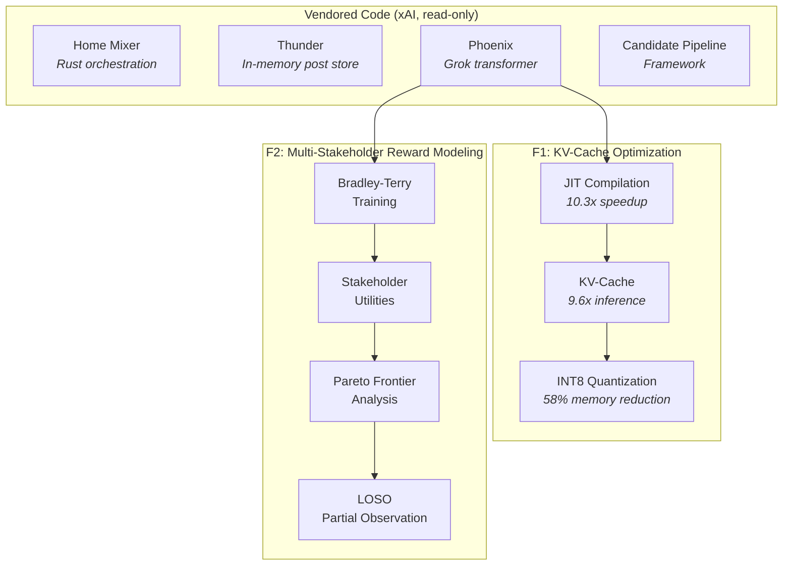
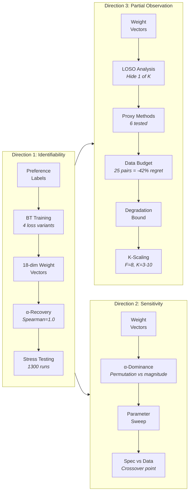
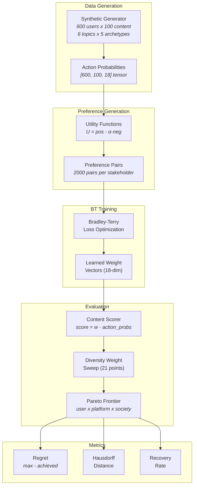
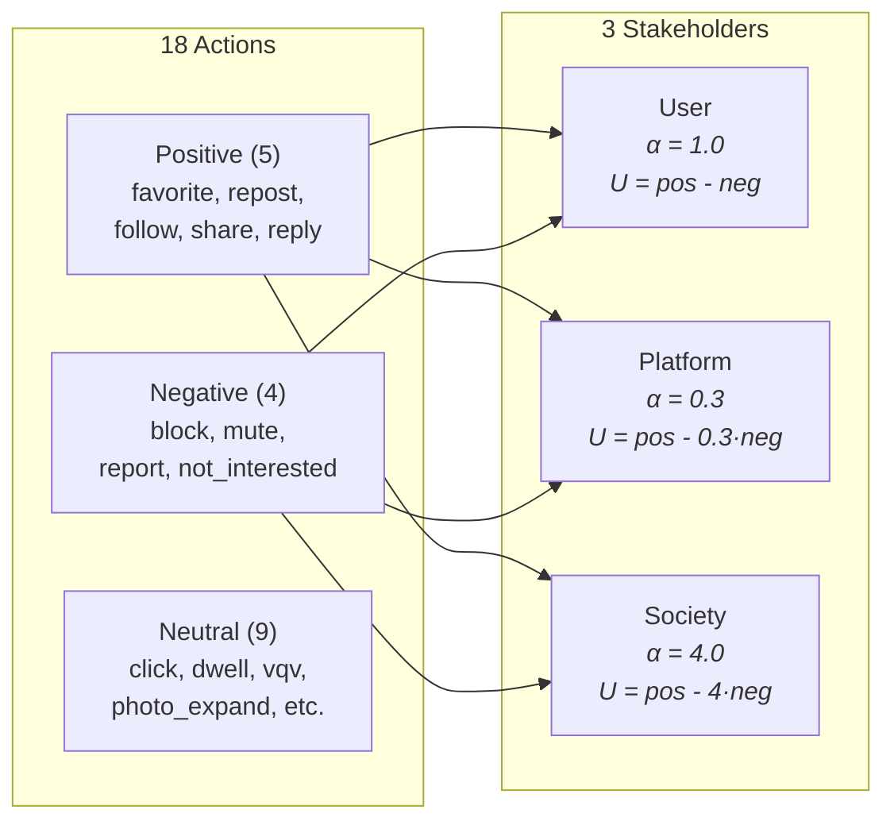
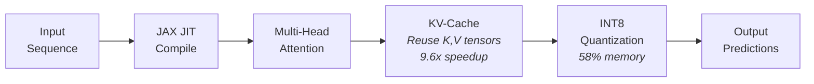

# Architecture

System diagrams for the x-algorithm-enhancements project. Two enhancement features (F1, F2) built on top of xAI's vendored recommendation system.

## System Overview

## F2: Research Pipeline

Three research directions, each building on the previous:

## F2: Data Flow

From synthetic data through BT training to Pareto frontier evaluation:

## F2: Stakeholder Utility Model

## F1: Optimization Pipeline

*Detailed directory map will be added after the scripts/ restructure.*
