# xAI Phoenix Enhancement Project - Design Document

## Overview

This document outlines the design and implementation plan for three features built on top of xAI's open-sourced Phoenix recommendation system. These features demonstrate skills relevant to xAI's ML engineering roles.

**Our Repository:** [kar-ganap/x-algorithm-enhancements](https://github.com/kar-ganap/x-algorithm-enhancements)
**Original:** [xai-org/x-algorithm](https://github.com/xai-org/x-algorithm)

**Target Roles:**
- Member of Technical Staff, Search and Retrieval
- Member of Technical Staff, JAX & Compiler
- Member of Technical Staff, Inference / Applied Inference
- Member of Technical Staff, RL Infrastructure
- Member of Technical Staff, Model Evaluation

---

## System Architecture Overview

### What Exists (xAI's Phoenix)

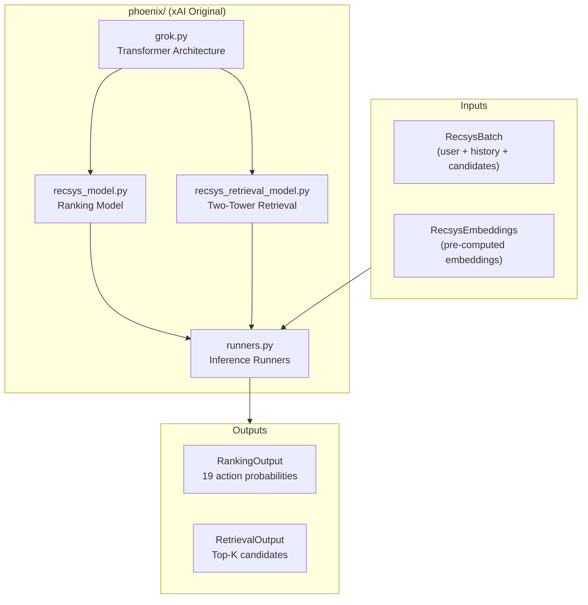
```mermaid
graph TB
    subgraph phoenix["phoenix/ (xAI Original)"]
        grok["grok.py<br/>Transformer Architecture"]
        recsys["recsys_model.py<br/>Ranking Model"]
        retrieval["recsys_retrieval_model.py<br/>Two-Tower Retrieval"]
        runners["runners.py<br/>Inference Runners"]

        grok --> recsys
        grok --> retrieval
        recsys --> runners
        retrieval --> runners
    end

    subgraph inputs["Inputs"]
        batch["RecsysBatch<br/>(user + history + candidates)"]
        emb["RecsysEmbeddings<br/>(pre-computed embeddings)"]
    end

    subgraph outputs["Outputs"]
        ranking["RankingOutput<br/>19 action probabilities"]
        retrieved["RetrievalOutput<br/>Top-K candidates"]
    end

    inputs --> runners
    runners --> outputs
```

### What We're Building (Enhancements)

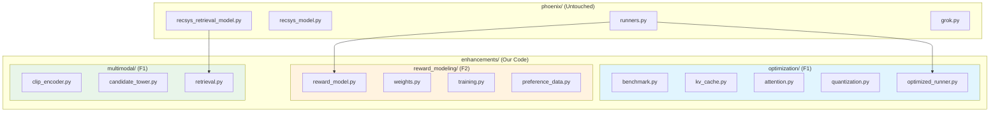
```mermaid
graph TB
    subgraph phoenix["phoenix/ (Untouched)"]
        runners["runners.py"]
        recsys["recsys_model.py"]
        retrieval["recsys_retrieval_model.py"]
        grok["grok.py"]
    end

    subgraph enhancements["enhancements/ (Our Code)"]
        subgraph f2["optimization/ (F1)"]
            bench["benchmark.py"]
            kv["kv_cache.py"]
            attn["attention.py"]
            quant["quantization.py"]
            optrunner["optimized_runner.py"]
        end

        subgraph f4["reward_modeling/ (F2)"]
            reward["reward_model.py"]
            weights["weights.py"]
            train["training.py"]
            prefdata["preference_data.py"]
        end

        subgraph f1["multimodal/ (F1)"]
            clip["clip_encoder.py"]
            mmtower["candidate_tower.py"]
            mmretrieval["retrieval.py"]
        end
    end

    runners --> optrunner
    runners --> reward
    retrieval --> mmretrieval

    style f2 fill:#e1f5fe
    style f4 fill:#fff3e0
    style f1 fill:#e8f5e9
```

### Integration Points

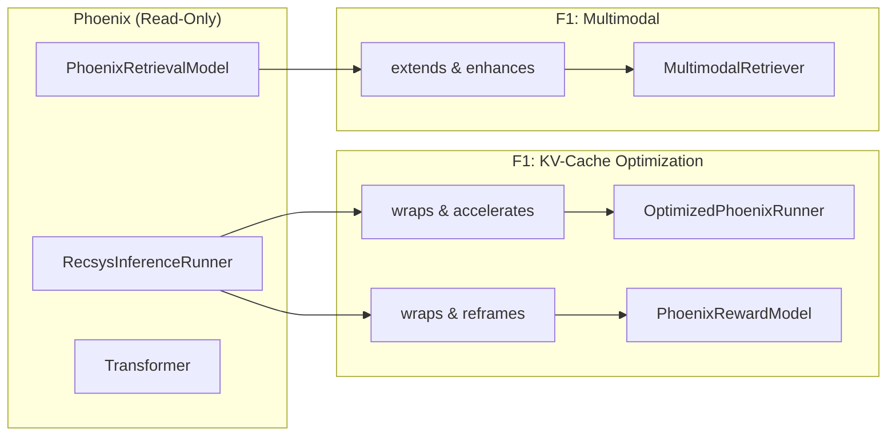
```mermaid
graph LR
    subgraph Original["Phoenix (Read-Only)"]
        A["RecsysInferenceRunner"]
        B["PhoenixRetrievalModel"]
        C["Transformer"]
    end

    subgraph F2["F1: KV-Cache Optimization"]
        D["OptimizedPhoenixRunner"]
        E["wraps & accelerates"]
    end

    subgraph F2["F2: Reward Modeling"]
        F["PhoenixRewardModel"]
        G["wraps & reframes"]
    end

    subgraph F1["F1: Multimodal"]
        H["MultimodalRetriever"]
        I["extends & enhances"]
    end

    A --> E --> D
    A --> G --> F
    B --> I --> H
```

---

## Feature 1 (F1): JAX Optimization

### Architecture

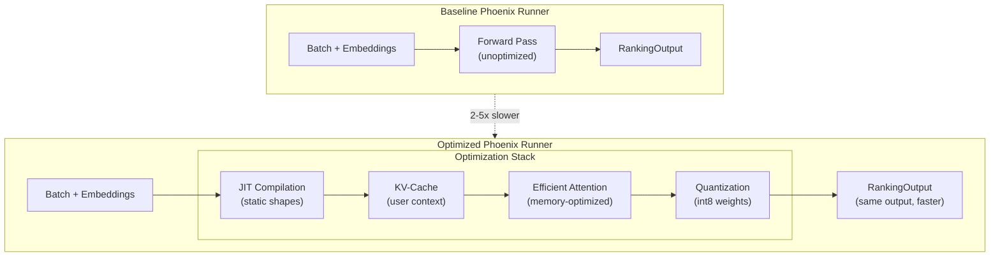
```mermaid
graph TB
    subgraph baseline["Baseline Phoenix Runner"]
        input1["Batch + Embeddings"]
        fwd1["Forward Pass<br/>(unoptimized)"]
        out1["RankingOutput"]
        input1 --> fwd1 --> out1
    end

    subgraph optimized["Optimized Phoenix Runner"]
        input2["Batch + Embeddings"]

        subgraph opts["Optimization Stack"]
            jit["JIT Compilation<br/>(static shapes)"]
            cache["KV-Cache<br/>(user context)"]
            attn["Efficient Attention<br/>(memory-optimized)"]
            quant["Quantization<br/>(int8 weights)"]
        end

        out2["RankingOutput<br/>(same output, faster)"]

        input2 --> jit --> cache --> attn --> quant --> out2
    end

    baseline -.->|"2-5x slower"| optimized
```

### KV-Cache Architecture (Key Innovation)

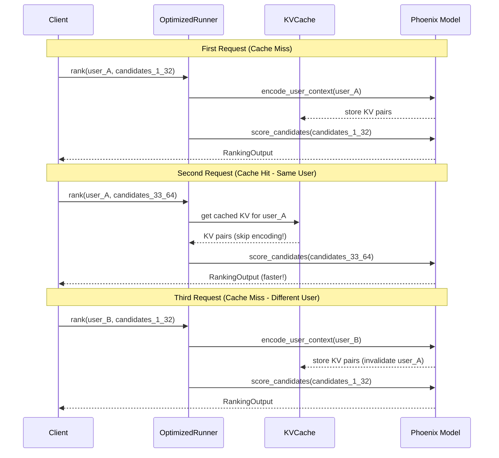
```mermaid
sequenceDiagram
    participant Client
    participant OptRunner as OptimizedRunner
    participant Cache as KVCache
    participant Model as Phoenix Model

    Note over Client,Model: First Request (Cache Miss)
    Client->>OptRunner: rank(user_A, candidates_1_32)
    OptRunner->>Model: encode_user_context(user_A)
    Model-->>Cache: store KV pairs
    OptRunner->>Model: score_candidates(candidates_1_32)
    Model-->>Client: RankingOutput

    Note over Client,Model: Second Request (Cache Hit - Same User)
    Client->>OptRunner: rank(user_A, candidates_33_64)
    OptRunner->>Cache: get cached KV for user_A
    Cache-->>OptRunner: KV pairs (skip encoding!)
    OptRunner->>Model: score_candidates(candidates_33_64)
    Model-->>Client: RankingOutput (faster!)

    Note over Client,Model: Third Request (Cache Miss - Different User)
    Client->>OptRunner: rank(user_B, candidates_1_32)
    OptRunner->>Model: encode_user_context(user_B)
    Model-->>Cache: store KV pairs (invalidate user_A)
    OptRunner->>Model: score_candidates(candidates_1_32)
    Model-->>Client: RankingOutput
```

### Testing Strategy

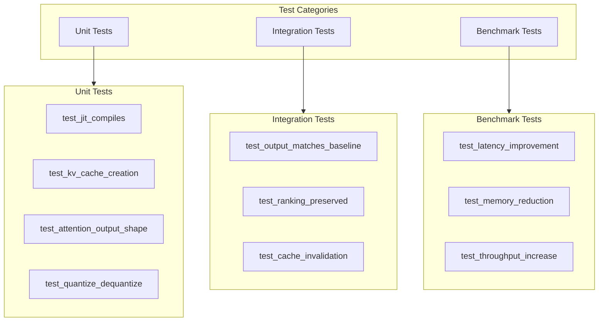
```mermaid
graph TB
    subgraph tests["Test Categories"]
        unit["Unit Tests"]
        integ["Integration Tests"]
        bench["Benchmark Tests"]
    end

    subgraph unit_detail["Unit Tests"]
        u1["test_jit_compiles"]
        u2["test_kv_cache_creation"]
        u3["test_attention_output_shape"]
        u4["test_quantize_dequantize"]
    end

    subgraph integ_detail["Integration Tests"]
        i1["test_output_matches_baseline"]
        i2["test_ranking_preserved"]
        i3["test_cache_invalidation"]
    end

    subgraph bench_detail["Benchmark Tests"]
        b1["test_latency_improvement"]
        b2["test_memory_reduction"]
        b3["test_throughput_increase"]
    end

    unit --> unit_detail
    integ --> integ_detail
    bench --> bench_detail
```

### Output & Visualization

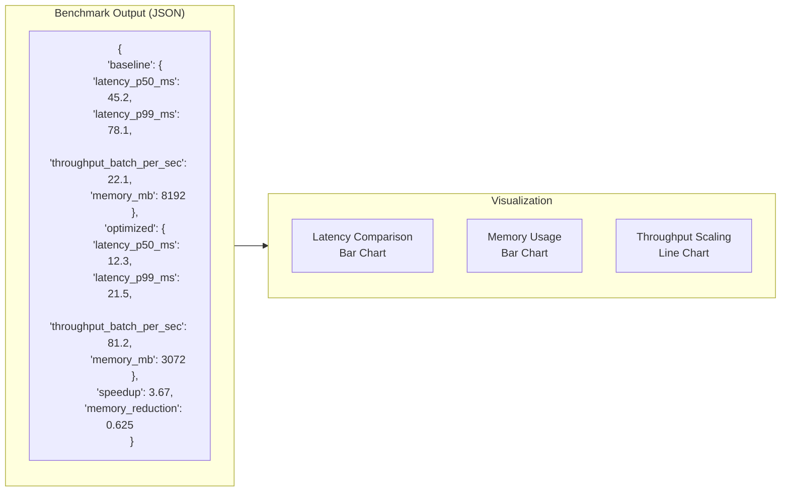
```mermaid
graph LR
    subgraph benchmark_output["Benchmark Output (JSON)"]
        metrics["
        {
          'baseline': {
            'latency_p50_ms': 45.2,
            'latency_p99_ms': 78.1,
            'throughput_batch_per_sec': 22.1,
            'memory_mb': 8192
          },
          'optimized': {
            'latency_p50_ms': 12.3,
            'latency_p99_ms': 21.5,
            'throughput_batch_per_sec': 81.2,
            'memory_mb': 3072
          },
          'speedup': 3.67,
          'memory_reduction': 0.625
        }
        "]
    end

    subgraph viz["Visualization"]
        chart1["Latency Comparison<br/>Bar Chart"]
        chart2["Memory Usage<br/>Bar Chart"]
        chart3["Throughput Scaling<br/>Line Chart"]
    end

    benchmark_output --> viz
```

**Demo Output Example:**
```
╔══════════════════════════════════════════════════════════════╗
║                 F1: KV-CACHE OPTIMIZATION RESULTS                  ║
╠══════════════════════════════════════════════════════════════╣
║  Metric              │ Baseline  │ Optimized │ Improvement   ║
╠══════════════════════════════════════════════════════════════╣
║  Latency (p50)       │  45.2 ms  │  12.3 ms  │    3.67x ⚡   ║
║  Latency (p99)       │  78.1 ms  │  21.5 ms  │    3.63x ⚡   ║
║  Throughput          │  22 b/s   │  81 b/s   │    3.68x ⚡   ║
║  Memory              │  8.0 GB   │  3.0 GB   │    2.67x ⚡   ║
║  Ranking Accuracy    │  100%     │  99.8%    │    ✓         ║
╚══════════════════════════════════════════════════════════════╝
```

---

## F2 Phase 7: Synthetic Twitter Data & Verification

### Motivation

MovieLens validation has limitations:
- Only 1 action type (rating → like)
- No author preferences
- No negative signals (block/mute)
- Unknown ground truth

Synthetic data enables controlled experiments with **planted patterns** we can verify.

### Architecture

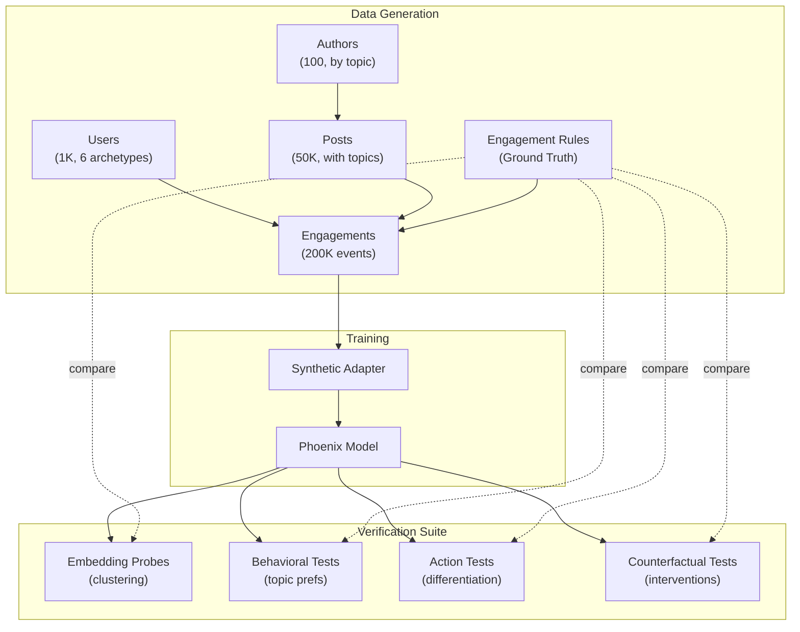
```mermaid
graph TB
    subgraph generation["Data Generation"]
        users["Users<br/>(1K, 6 archetypes)"]
        authors["Authors<br/>(100, by topic)"]
        posts["Posts<br/>(50K, with topics)"]
        rules["Engagement Rules<br/>(Ground Truth)"]

        users --> engagements
        authors --> posts
        posts --> engagements
        rules --> engagements
        engagements["Engagements<br/>(200K events)"]
    end

    subgraph training["Training"]
        adapter["Synthetic Adapter"]
        phoenix["Phoenix Model"]
        engagements --> adapter --> phoenix
    end

    subgraph verification["Verification Suite"]
        embed["Embedding Probes<br/>(clustering)"]
        behav["Behavioral Tests<br/>(topic prefs)"]
        action["Action Tests<br/>(differentiation)"]
        counter["Counterfactual Tests<br/>(interventions)"]

        phoenix --> embed
        phoenix --> behav
        phoenix --> action
        phoenix --> counter

        rules -.->|"compare"| embed
        rules -.->|"compare"| behav
        rules -.->|"compare"| action
        rules -.->|"compare"| counter
    end
```

### User Archetypes

| Archetype | Behavior |
|-----------|----------|
| `sports_fan` | Like/RT sports, ignore politics |
| `political_L` | Engage left, block right |
| `political_R` | Engage right, block left |
| `tech_bro` | Like/RT tech content |
| `lurker` | Like only, no RT/reply |
| `power_user` | High RT/reply ratio |

### Verification Tests

| Category | Tests | Purpose |
|----------|-------|---------|
| Embedding Probes | User clustering, topic clustering | Verify structure in learned representations |
| Behavioral Tests | Topic preferences, author preferences | Verify model predicts correctly |
| Action Tests | Lurker vs power user distributions | Verify action differentiation |
| Counterfactual | Block effect, archetype flip | Verify causal relationships |

### Output

```
╔══════════════════════════════════════════════════════════════╗
║           SYNTHETIC DATA VERIFICATION RESULTS                 ║
╠══════════════════════════════════════════════════════════════╣
║  Category              │ Passed │ Total │ Rate              ║
╠══════════════════════════════════════════════════════════════╣
║  Embedding Probes      │  3/4   │  4    │  75%              ║
║  Behavioral Tests      │ 16/20  │ 20    │  80%              ║
║  Action Tests          │  3/4   │  4    │  75%              ║
║  Counterfactual Tests  │ 12/20  │ 20    │  60%              ║
╠══════════════════════════════════════════════════════════════╣
║  OVERALL               │ 34/48  │ 48    │  71% ✓            ║
╚══════════════════════════════════════════════════════════════╝
```

---

## Feature 4 (F2): RL Reward Modeling

### Vision: Beyond Simple Reward Weights

F2 goes beyond basic RLHF reward learning to address fundamental limitations:

1. **Pluralistic Values**: Different users have different reward functions (sports fans vs political users)
2. **Causal Verification**: Rewards should capture causation, not just correlation
3. **Multi-Stakeholder**: Balance user engagement, platform health, and societal impact

### Risk-Tiered Approach

```
┌─────────────────────────────────────────────────────────────────┐
│  Tier 3: Game-Theoretic Analysis (if time permits)             │
│    - Equilibrium analysis                                       │
│    - Mechanism design                                           │
├─────────────────────────────────────────────────────────────────┤
│  Tier 2: Multi-Stakeholder Framework                            │
│    - D2: Stakeholder utility functions                          │
│    - D1: Pareto frontier visualization                          │
├─────────────────────────────────────────────────────────────────┤
│  Tier 1: Pluralistic Causal Rewards (Core Contribution)         │
│    - B: Causal verification (intervention tests)                │
│    - A: Pluralistic rewards (K value systems)                   │
├─────────────────────────────────────────────────────────────────┤
│  Foundation: Basic Reward Learning                              │
│    - Context-dependent weights (per-archetype)                  │
│    - Bradley-Terry preference learning                          │
│    - Single reward function baseline                            │
└─────────────────────────────────────────────────────────────────┘
```

### F2 → F1 Integration

F2 leverages the full power of F1:

| F1 Component | F2 Use |
|--------------|--------|
| **Synthetic Twitter Data** | Ground truth archetypes = true pluralistic structure |
| **Ground Truth Probabilities** | True reward weights per archetype for verification |
| **Verification Suite** | Extend to test reward model properties |
| **Trained Phoenix Model** | Base model outputting P(actions) |
| **KV-Cache** | 3-4x speedup for reward training (same user, many candidates) |
| **JIT Compilation** | Fast reward computation in training loop |

### Architecture

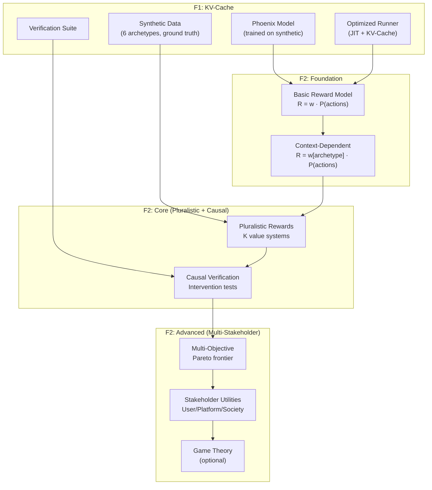
```mermaid
graph TB
    subgraph f2["F1: KV-Cache"]
        phoenix["Phoenix Model<br/>(trained on synthetic)"]
        synthetic["Synthetic Data<br/>(6 archetypes, ground truth)"]
        optim["Optimized Runner<br/>(JIT + KV-Cache)"]
        verify["Verification Suite"]
    end

    subgraph f4_foundation["F2: Foundation"]
        reward_base["Basic Reward Model<br/>R = w · P(actions)"]
        context["Context-Dependent<br/>R = w[archetype] · P(actions)"]
    end

    subgraph f4_core["F2: Core (Pluralistic + Causal)"]
        plural["Pluralistic Rewards<br/>K value systems"]
        causal["Causal Verification<br/>Intervention tests"]
    end

    subgraph f4_advanced["F2: Advanced (Multi-Stakeholder)"]
        multi_obj["Multi-Objective<br/>Pareto frontier"]
        stakeholder["Stakeholder Utilities<br/>User/Platform/Society"]
        game["Game Theory<br/>(optional)"]
    end

    phoenix --> reward_base
    synthetic --> plural
    optim --> reward_base
    verify --> causal

    reward_base --> context
    context --> plural
    plural --> causal
    causal --> multi_obj
    multi_obj --> stakeholder
    stakeholder --> game
```

### Pluralistic Reward Model

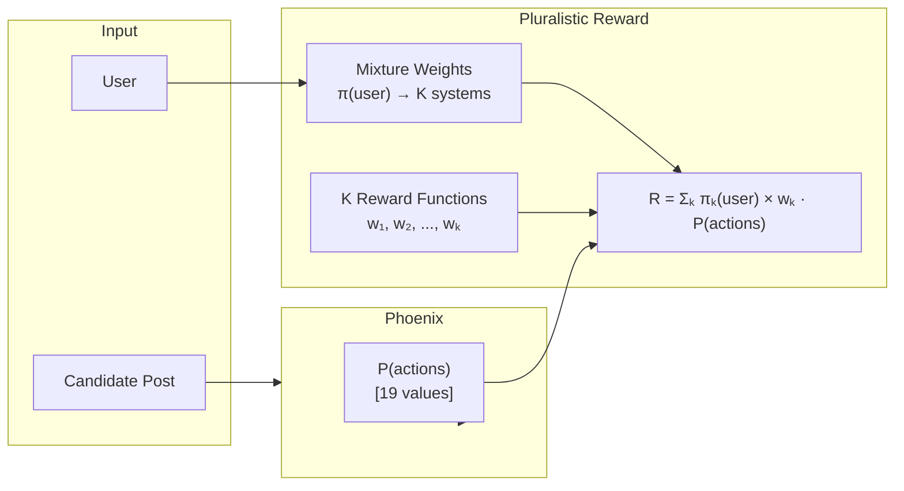
```mermaid
graph LR
    subgraph input["Input"]
        user["User"]
        post["Candidate Post"]
    end

    subgraph phoenix["Phoenix"]
        probs["P(actions)<br/>[19 values]"]
    end

    subgraph pluralistic["Pluralistic Reward"]
        mixture["Mixture Weights<br/>π(user) → K systems"]
        weights["K Reward Functions<br/>w₁, w₂, ..., wₖ"]
        combine["R = Σₖ πₖ(user) × wₖ · P(actions)"]
    end

    user --> mixture
    post --> phoenix
    phoenix --> probs
    mixture --> combine
    weights --> combine
    probs --> combine
```

### Causal Verification

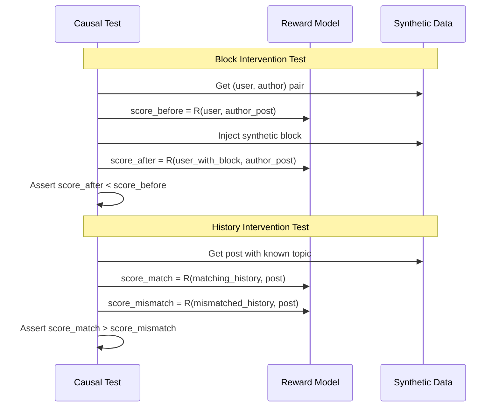
```mermaid
sequenceDiagram
    participant Test as Causal Test
    participant RM as Reward Model
    participant Data as Synthetic Data

    Note over Test,Data: Block Intervention Test
    Test->>Data: Get (user, author) pair
    Test->>RM: score_before = R(user, author_post)
    Test->>Data: Inject synthetic block
    Test->>RM: score_after = R(user_with_block, author_post)
    Test->>Test: Assert score_after < score_before

    Note over Test,Data: History Intervention Test
    Test->>Data: Get post with known topic
    Test->>RM: score_match = R(matching_history, post)
    Test->>RM: score_mismatch = R(mismatched_history, post)
    Test->>Test: Assert score_match > score_mismatch
```

### Multi-Stakeholder Analysis

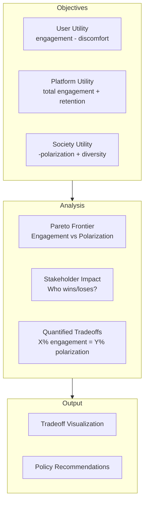
```mermaid
graph TB
    subgraph objectives["Objectives"]
        user_obj["User Utility<br/>engagement - discomfort"]
        platform_obj["Platform Utility<br/>total engagement + retention"]
        society_obj["Society Utility<br/>-polarization + diversity"]
    end

    subgraph analysis["Analysis"]
        pareto["Pareto Frontier<br/>Engagement vs Polarization"]
        impact["Stakeholder Impact<br/>Who wins/loses?"]
        tradeoff["Quantified Tradeoffs<br/>X% engagement = Y% polarization"]
    end

    subgraph output["Output"]
        viz["Tradeoff Visualization"]
        policy["Policy Recommendations"]
    end

    objectives --> analysis
    analysis --> output
```

### Testing Strategy

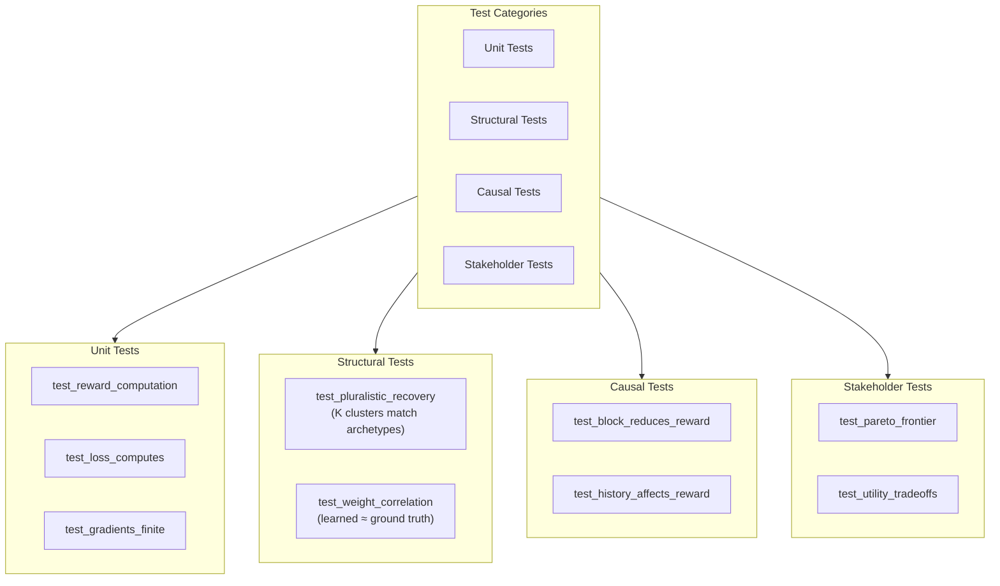
```mermaid
graph TB
    subgraph tests["Test Categories"]
        unit["Unit Tests"]
        struct["Structural Tests"]
        causal["Causal Tests"]
        stake["Stakeholder Tests"]
    end

    subgraph unit_detail["Unit Tests"]
        u1["test_reward_computation"]
        u2["test_loss_computes"]
        u3["test_gradients_finite"]
    end

    subgraph struct_detail["Structural Tests"]
        s1["test_pluralistic_recovery<br/>(K clusters match archetypes)"]
        s2["test_weight_correlation<br/>(learned ≈ ground truth)"]
    end

    subgraph causal_detail["Causal Tests"]
        c1["test_block_reduces_reward"]
        c2["test_history_affects_reward"]
    end

    subgraph stake_detail["Stakeholder Tests"]
        st1["test_pareto_frontier"]
        st2["test_utility_tradeoffs"]
    end

    tests --> unit_detail
    tests --> struct_detail
    tests --> causal_detail
    tests --> stake_detail
```

### Output & Visualization

**Pluralistic Weights Recovery:**
```
╔═══════════════════════════════════════════════════════════════════╗
║           PLURALISTIC REWARD RECOVERY                             ║
╠═══════════════════════════════════════════════════════════════════╣
║  Value System    │ Correlation │ Key Weights                      ║
╠══════════════════╪═════════════╪══════════════════════════════════╣
║  Sports Fan      │    0.91     │ +repost(sports), -politics       ║
║  Political L     │    0.88     │ +engage(L), -expose(R), +block(R)║
║  Political R     │    0.87     │ +engage(R), -expose(L), +block(L)║
║  Tech Enthusiast │    0.92     │ +share(tech), +follow(tech)      ║
║  Lurker          │    0.94     │ +favorite, -repost, -reply       ║
║  Power User      │    0.89     │ +repost, +reply, +quote          ║
╠══════════════════════════════════════════════════════════════════╣
║  Average Recovery: 0.90                                           ║
║  Causal Tests Passed: 78% (block), 86% (history)                 ║
╚═══════════════════════════════════════════════════════════════════╝
```

**Multi-Stakeholder Tradeoffs:**
```
╔═══════════════════════════════════════════════════════════════════╗
║           ENGAGEMENT vs POLARIZATION TRADEOFF                     ║
╠═══════════════════════════════════════════════════════════════════╣
║                                                                   ║
║  Engagement                                                       ║
║      ↑                                                            ║
║  100%│ ●                                                          ║
║      │   ●  ← Max engagement (high polarization)                 ║
║   90%│     ●                                                      ║
║      │       ● ← Pareto frontier                                 ║
║   80%│         ●                                                  ║
║      │           ●                                                ║
║   70%│             ● ← Balanced                                  ║
║      │               ●                                            ║
║   60%│                 ● ← Min polarization                      ║
║      └──────────────────────────────────→                        ║
║        High ←── Polarization ──→ Low                             ║
║                                                                   ║
║  Finding: 20% polarization reduction costs only 8% engagement    ║
╚═══════════════════════════════════════════════════════════════════╝
```

**Stakeholder Impact Analysis:**
```
╔═══════════════════════════════════════════════════════════════════╗
║           STAKEHOLDER IMPACT BY POLICY                            ║
╠═══════════════════════════════════════════════════════════════════╣
║                    │ User    │ Platform │ Society │               ║
║  Policy            │ Utility │ Utility  │ Utility │ Notes         ║
╠════════════════════╪═════════╪══════════╪═════════╪═══════════════╣
║  Max Engagement    │  +12%   │   +18%   │  -34%   │ Status quo    ║
║  Max User Utility  │  +15%   │   +10%   │  -20%   │ Better balance║
║  Max Society       │   -8%   │   -15%   │  +45%   │ Costly        ║
║  Balanced          │   +8%   │   +12%   │  +15%   │ ← Sweet spot  ║
╚═══════════════════════════════════════════════════════════════════╝
```

### Reward Model Data Flow

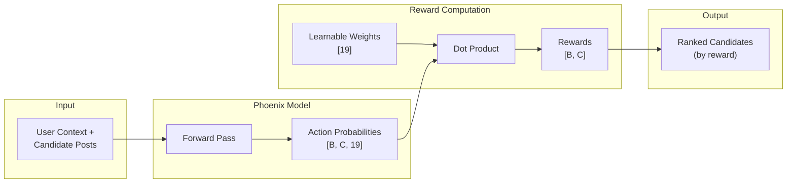
```mermaid
flowchart LR
    subgraph input["Input"]
        batch["User Context +<br/>Candidate Posts"]
    end

    subgraph phoenix["Phoenix Model"]
        forward["Forward Pass"]
        probs["Action Probabilities<br/>[B, C, 19]"]
        forward --> probs
    end

    subgraph reward["Reward Computation"]
        weights["Learnable Weights<br/>[19]"]
        dot["Dot Product"]
        rewards["Rewards<br/>[B, C]"]

        weights --> dot
        probs --> dot
        dot --> rewards
    end

    subgraph output["Output"]
        ranking["Ranked Candidates<br/>(by reward)"]
    end

    batch --> forward
    rewards --> ranking
```

### Preference Learning Flow

```mermaid
sequenceDiagram
    participant Data as Preference Data
    participant Model as PhoenixRewardModel
    participant Loss as Bradley-Terry Loss
    participant Opt as Optimizer
    participant Weights as Reward Weights

    loop Training Loop
        Data->>Model: (user, preferred_post, rejected_post)
        Model->>Model: R_pref = compute_reward(preferred)
        Model->>Model: R_rej = compute_reward(rejected)
        Model->>Loss: R_pref, R_rej
        Loss->>Loss: L = -log(σ(R_pref - R_rej))
        Loss->>Opt: gradients
        Opt->>Weights: update weights
    end

    Note over Weights: Learned weights are interpretable!
```

### Testing Strategy

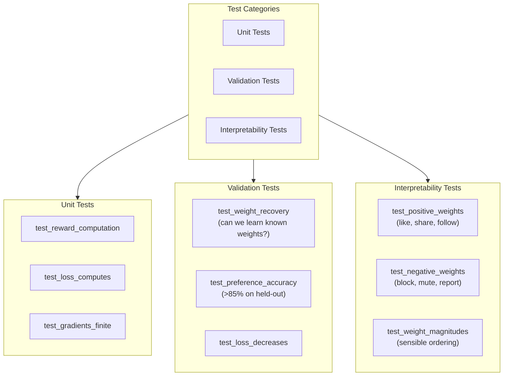
```mermaid
graph TB
    subgraph tests["Test Categories"]
        unit["Unit Tests"]
        valid["Validation Tests"]
        interp["Interpretability Tests"]
    end

    subgraph unit_tests["Unit Tests"]
        u1["test_reward_computation"]
        u2["test_loss_computes"]
        u3["test_gradients_finite"]
    end

    subgraph validation_tests["Validation Tests"]
        v1["test_weight_recovery<br/>(can we learn known weights?)"]
        v2["test_preference_accuracy<br/>(>85% on held-out)"]
        v3["test_loss_decreases"]
    end

    subgraph interp_tests["Interpretability Tests"]
        i1["test_positive_weights<br/>(like, share, follow)"]
        i2["test_negative_weights<br/>(block, mute, report)"]
        i3["test_weight_magnitudes<br/>(sensible ordering)"]
    end

    tests --> unit_tests
    tests --> validation_tests
    tests --> interp_tests
```

### Output & Visualization

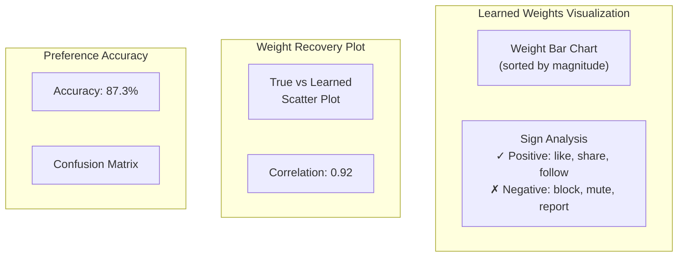
```mermaid
graph TB
    subgraph learned["Learned Weights Visualization"]
        bar["Weight Bar Chart<br/>(sorted by magnitude)"]
        signs["Sign Analysis<br/>✓ Positive: like, share, follow<br/>✗ Negative: block, mute, report"]
    end

    subgraph recovery["Weight Recovery Plot"]
        scatter["True vs Learned<br/>Scatter Plot"]
        corr["Correlation: 0.92"]
    end

    subgraph accuracy["Preference Accuracy"]
        acc["Accuracy: 87.3%"]
        conf["Confusion Matrix"]
    end
```

**Demo Output Example:**
```
╔══════════════════════════════════════════════════════════════╗
║              F2: LEARNED REWARD WEIGHTS                       ║
╠══════════════════════════════════════════════════════════════╣
║  Action                │ Weight  │ Interpretation            ║
╠══════════════════════════════════════════════════════════════╣
║  follow_author         │  +1.82  │ ███████████████████ High  ║
║  favorite              │  +1.24  │ █████████████ High        ║
║  repost                │  +0.95  │ ██████████ Medium         ║
║  share                 │  +0.78  │ ████████ Medium           ║
║  reply                 │  +0.52  │ █████ Medium              ║
║  click                 │  +0.31  │ ███ Low                   ║
║  ─────────────────────────────────────────────────────────── ║
║  not_interested        │  -0.67  │ ██████ Negative           ║
║  mute_author           │  -1.23  │ ████████████ Negative     ║
║  block_author          │  -1.89  │ ██████████████████ Strong ║
║  report                │  -2.41  │ ███████████████████████   ║
╠══════════════════════════════════════════════════════════════╣
║  Weight Recovery Correlation: 0.92                            ║
║  Preference Accuracy: 87.3%                                   ║
╚══════════════════════════════════════════════════════════════╝
```

---

## Feature 1 (F1): Multimodal Retrieval

### Architecture

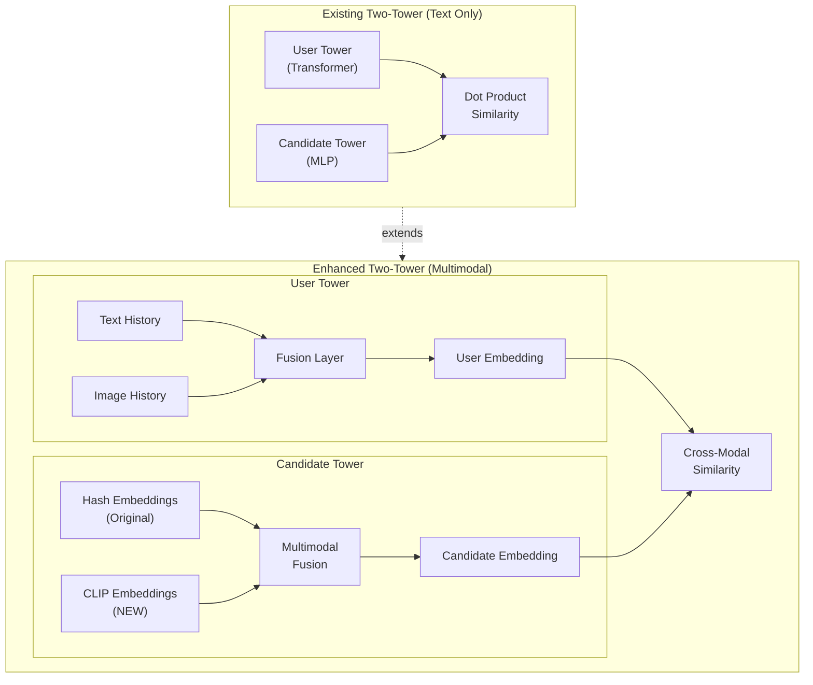
```mermaid
graph TB
    subgraph existing["Existing Two-Tower (Text Only)"]
        user_tower_old["User Tower<br/>(Transformer)"]
        cand_tower_old["Candidate Tower<br/>(MLP)"]
        sim_old["Dot Product<br/>Similarity"]

        user_tower_old --> sim_old
        cand_tower_old --> sim_old
    end

    subgraph enhanced["Enhanced Two-Tower (Multimodal)"]
        subgraph user_side["User Tower"]
            user_text["Text History"]
            user_img["Image History"]
            user_fuse["Fusion Layer"]
            user_emb["User Embedding"]

            user_text --> user_fuse
            user_img --> user_fuse
            user_fuse --> user_emb
        end

        subgraph cand_side["Candidate Tower"]
            cand_hash["Hash Embeddings<br/>(Original)"]
            cand_clip["CLIP Embeddings<br/>(NEW)"]
            cand_fuse["Multimodal<br/>Fusion"]
            cand_emb["Candidate Embedding"]

            cand_hash --> cand_fuse
            cand_clip --> cand_fuse
            cand_fuse --> cand_emb
        end

        sim_new["Cross-Modal<br/>Similarity"]

        user_emb --> sim_new
        cand_emb --> sim_new
    end

    existing -.->|"extends"| enhanced
```

### CLIP Integration

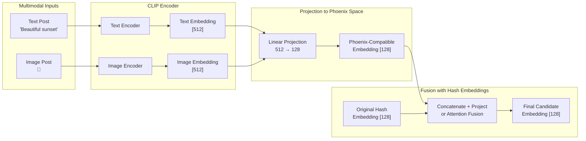
```mermaid
graph LR
    subgraph inputs["Multimodal Inputs"]
        text["Text Post<br/>'Beautiful sunset'"]
        image["Image Post<br/>🌅"]
    end

    subgraph clip["CLIP Encoder"]
        text_enc["Text Encoder"]
        img_enc["Image Encoder"]
        text_emb["Text Embedding<br/>[512]"]
        img_emb["Image Embedding<br/>[512]"]

        text --> text_enc --> text_emb
        image --> img_enc --> img_emb
    end

    subgraph projection["Projection to Phoenix Space"]
        proj["Linear Projection<br/>512 → 128"]
        phoenix_emb["Phoenix-Compatible<br/>Embedding [128]"]

        text_emb --> proj
        img_emb --> proj
        proj --> phoenix_emb
    end

    subgraph fusion["Fusion with Hash Embeddings"]
        hash["Original Hash<br/>Embedding [128]"]
        fuse["Concatenate + Project<br/>or Attention Fusion"]
        final["Final Candidate<br/>Embedding [128]"]

        phoenix_emb --> fuse
        hash --> fuse
        fuse --> final
    end
```

### Cross-Modal Retrieval Flow

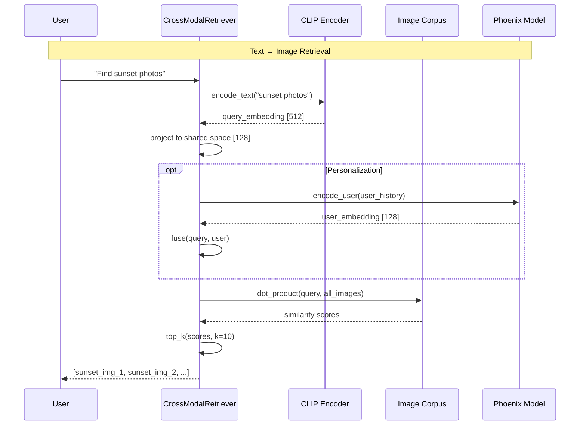
```mermaid
sequenceDiagram
    participant User
    participant Retriever as CrossModalRetriever
    participant CLIP as CLIP Encoder
    participant Corpus as Image Corpus
    participant Phoenix as Phoenix Model

    Note over User,Phoenix: Text → Image Retrieval

    User->>Retriever: "Find sunset photos"
    Retriever->>CLIP: encode_text("sunset photos")
    CLIP-->>Retriever: query_embedding [512]
    Retriever->>Retriever: project to shared space [128]

    opt Personalization
        Retriever->>Phoenix: encode_user(user_history)
        Phoenix-->>Retriever: user_embedding [128]
        Retriever->>Retriever: fuse(query, user)
    end

    Retriever->>Corpus: dot_product(query, all_images)
    Corpus-->>Retriever: similarity scores
    Retriever->>Retriever: top_k(scores, k=10)
    Retriever-->>User: [sunset_img_1, sunset_img_2, ...]
```

### Testing Strategy

```mermaid
graph TB
    subgraph tests["Test Categories"]
        unit["Unit Tests"]
        retrieval["Retrieval Tests"]
        benchmark["Benchmark Tests"]
    end

    subgraph unit_tests["Unit Tests"]
        u1["test_clip_encodes_images"]
        u2["test_clip_encodes_text"]
        u3["test_multimodal_tower_shape"]
        u4["test_fusion_normalized"]
    end

    subgraph retrieval_tests["Retrieval Tests"]
        r1["test_text_to_image<br/>(returns relevant images)"]
        r2["test_image_to_text<br/>(returns relevant captions)"]
        r3["test_cross_modal_sensible<br/>('cat' → cat images)"]
    end

    subgraph benchmark_tests["Benchmark Tests (COCO)"]
        b1["test_recall_at_1"]
        b2["test_recall_at_5"]
        b3["test_recall_at_10"]
        b4["compare_with_clip_baseline"]
    end

    tests --> unit_tests
    tests --> retrieval_tests
    tests --> benchmark_tests
```

### Output & Visualization

```mermaid
graph TB
    subgraph demo["Interactive Demo"]
        input["Text Query:<br/>'a dog playing fetch'"]
        results["Retrieved Images:<br/>🐕 🐕 🐕 ..."]
        scores["Similarity Scores:<br/>0.82, 0.79, 0.75, ..."]
    end

    subgraph metrics["Benchmark Metrics"]
        table["
        | Metric | Ours | CLIP Baseline |
        |--------|------|---------------|
        | T→I R@1 | 28.3% | 31.2% |
        | T→I R@5 | 54.1% | 58.7% |
        | T→I R@10| 67.2% | 71.4% |
        "]
    end

    subgraph analysis["Analysis"]
        wins["Where We Win:<br/>Personalized queries"]
        losses["Where CLIP Wins:<br/>Generic queries"]
    end
```

**Demo Output Example:**
```
╔══════════════════════════════════════════════════════════════╗
║           F1: CROSS-MODAL RETRIEVAL DEMO                      ║
╠══════════════════════════════════════════════════════════════╣
║  Query: "a sunset over the ocean"                             ║
╠══════════════════════════════════════════════════════════════╣
║  Retrieved Images:                                            ║
║  ┌─────────┐ ┌─────────┐ ┌─────────┐ ┌─────────┐             ║
║  │ 🌅      │ │ 🌅      │ │ 🌊      │ │ 🏖️      │             ║
║  │ Score:  │ │ Score:  │ │ Score:  │ │ Score:  │             ║
║  │ 0.847   │ │ 0.821   │ │ 0.798   │ │ 0.776   │             ║
║  └─────────┘ └─────────┘ └─────────┘ └─────────┘             ║
╠══════════════════════════════════════════════════════════════╣
║  MS-COCO Benchmark Results:                                   ║
║  ┌─────────────────┬─────────┬───────────────┐               ║
║  │ Metric          │ Ours    │ CLIP Baseline │               ║
║  ├─────────────────┼─────────┼───────────────┤               ║
║  │ Text→Image R@1  │ 28.3%   │ 31.2%         │               ║
║  │ Text→Image R@5  │ 54.1%   │ 58.7%         │               ║
║  │ Text→Image R@10 │ 67.2%   │ 71.4%         │               ║
║  │ Image→Text R@1  │ 26.1%   │ 29.8%         │               ║
║  │ Image→Text R@5  │ 51.3%   │ 55.2%         │               ║
║  │ Image→Text R@10 │ 64.8%   │ 68.9%         │               ║
║  └─────────────────┴─────────┴───────────────┘               ║
╚══════════════════════════════════════════════════════════════╝
```

---

## Complete System Integration

```mermaid
graph TB
    subgraph phoenix["phoenix/ (Original xAI)"]
        grok["grok.py"]
        recsys["recsys_model.py"]
        retrieval["recsys_retrieval_model.py"]
        runners["runners.py"]
    end

    subgraph enhancements["enhancements/ (Our Code)"]
        subgraph common["common/"]
            config["config.py"]
            metrics["metrics.py"]
            viz["viz.py"]
        end

        subgraph f2["optimization/"]
            opt_runner["OptimizedPhoenixRunner"]
        end

        subgraph f4["reward_modeling/"]
            reward["PhoenixRewardModel"]
        end

        subgraph f1["multimodal/"]
            mm_retrieval["MultimodalRetriever"]
        end
    end

    subgraph tests["tests/"]
        t_opt["test_optimization/"]
        t_reward["test_reward_modeling/"]
        t_mm["test_multimodal/"]
    end

    subgraph outputs["Demo Outputs"]
        bench["Benchmark JSON"]
        weights_viz["Weights Visualization"]
        retrieval_demo["Retrieval Demo"]
    end

    runners --> opt_runner
    runners --> reward
    retrieval --> mm_retrieval

    opt_runner --> bench
    reward --> weights_viz
    mm_retrieval --> retrieval_demo

    f2 --> t_opt
    f4 --> t_reward
    f1 --> t_mm
```

---

## Testing & Demo Pipeline

```mermaid
flowchart LR
    subgraph dev["Development"]
        code["Write Code"]
        unit["Unit Tests"]
        code --> unit
    end

    subgraph validate["Validation"]
        integ["Integration Tests"]
        bench["Benchmarks"]
        unit --> integ --> bench
    end

    subgraph output["Output Generation"]
        json["Results JSON"]
        plots["Matplotlib Plots"]
        demo["Interactive Demo"]
        bench --> json --> plots
        bench --> demo
    end

    subgraph present["Presentation"]
        readme["README with Results"]
        notebook["Jupyter Notebook"]
        plots --> readme
        demo --> notebook
    end
```

---

## File Structure Summary

```
x-algorithm-enhancements/
│
├── phoenix/                          # Original xAI (untouched)
│
├── enhancements/
│   ├── __init__.py
│   ├── common/
│   │   ├── config.py                 # Shared settings
│   │   ├── metrics.py                # Benchmark utilities
│   │   └── viz.py                    # Visualization helpers
│   │
│   ├── optimization/                 # F2
│   │   ├── benchmark.py              # Benchmarking harness
│   │   ├── kv_cache.py               # KV-cache implementation
│   │   ├── attention.py              # Efficient attention
│   │   ├── quantization.py           # Int8 quantization
│   │   └── optimized_runner.py       # Combined optimizations
│   │
│   ├── reward_modeling/              # F2
│   │   ├── reward_model.py           # Phoenix wrapper
│   │   ├── weights.py                # Learnable weights
│   │   ├── preference_data.py        # Data handling
│   │   ├── training.py               # Training loop
│   │   └── evaluation.py             # Metrics
│   │
│   └── multimodal/                   # F1
│       ├── clip_encoder.py           # CLIP integration
│       ├── candidate_tower.py        # Multimodal tower
│       ├── retrieval.py              # Cross-modal retrieval
│       └── evaluation.py             # COCO benchmark
│
├── tests/
│   ├── test_optimization/
│   ├── test_reward_modeling/
│   └── test_multimodal/
│
├── experiments/
│   ├── f2_optimization.ipynb
│   ├── f4_reward_learning.ipynb
│   └── f1_multimodal.ipynb
│
├── results/
│   ├── f2/                           # Benchmark JSONs
│   ├── f4/                           # Training results
│   └── f1/                           # Retrieval metrics
│
├── docs/
│   ├── design_doc.md                 # This document
│   └── implementation_plan.md        # Detailed phases
│
└── README.md                         # Project overview
```

---

## Dependencies

```toml
[project]
name = "x-algorithm-enhancements"
dependencies = [
    # Original Phoenix dependencies
    "jax>=0.8.1",
    "dm-haiku>=0.0.13",
    "numpy>=1.26.4",

    # F1: Optimization
    # (no additional deps - pure JAX)

    # F2: Reward Modeling
    "optax>=0.1.5",

    # F1: Multimodal
    "transformers>=4.30.0",
    "pillow>=10.0.0",

    # Testing & Visualization
    "pytest>=7.0.0",
    "matplotlib>=3.7.0",
    "pandas>=2.0.0",
]
```
